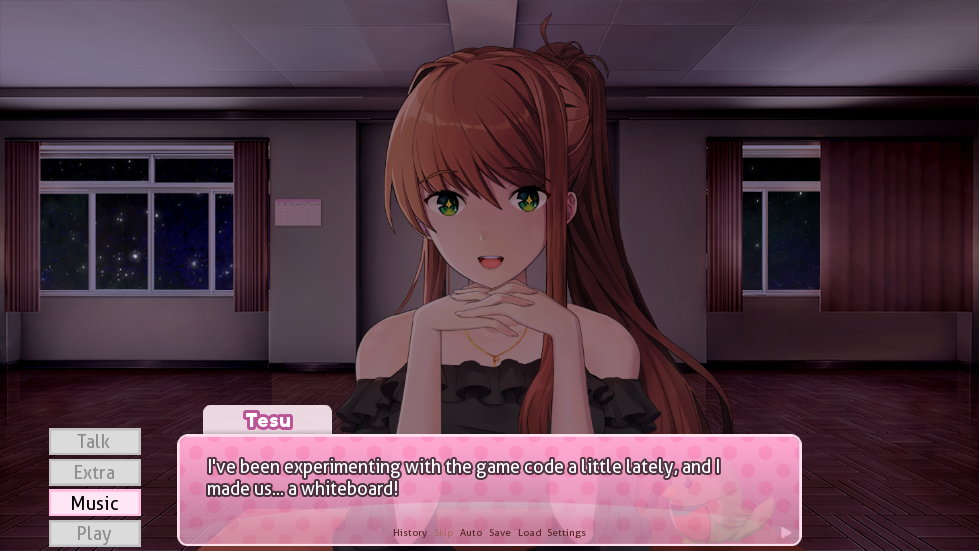
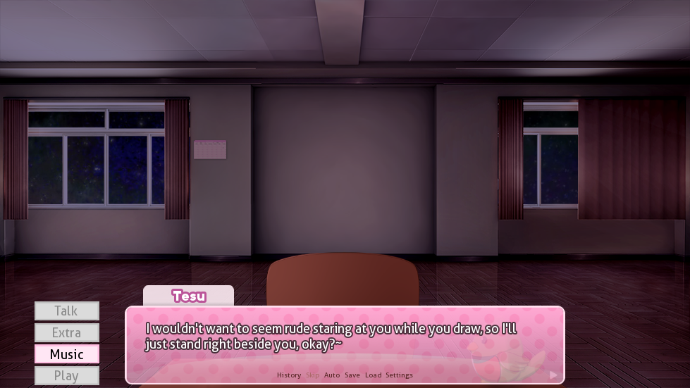
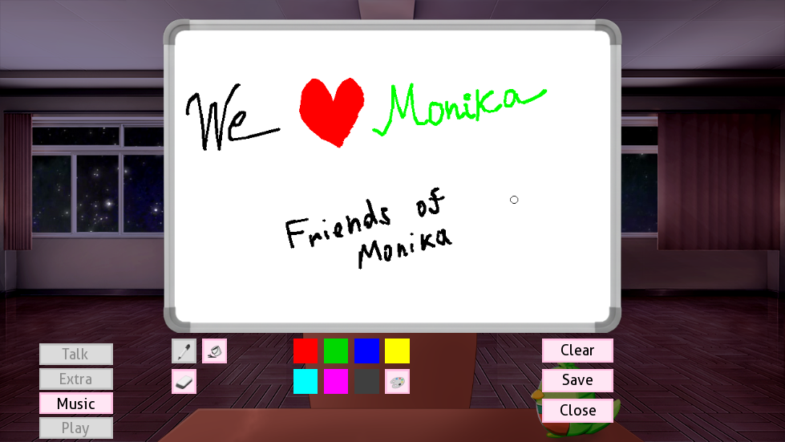
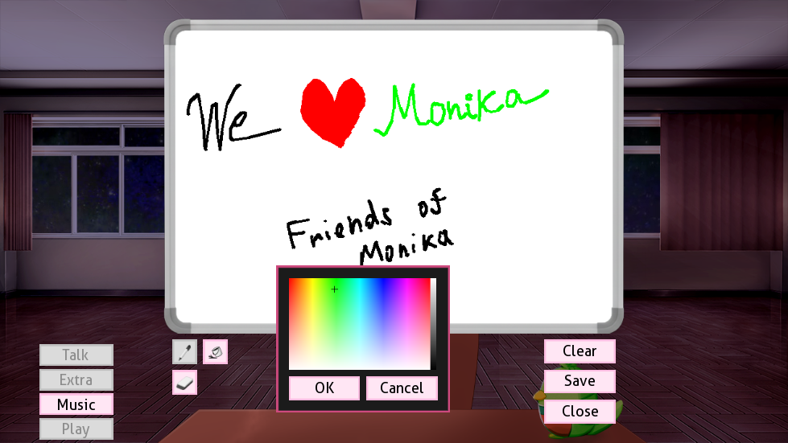
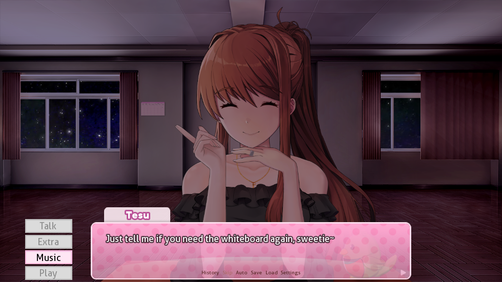

	<!--  -->
	<h1 align="center">🎨 Whiteboard Submod 🎨</h1>
	<h3 align="center">Adiciona um quadro branco (virtual) para você desenhar!~</h3>

	
	
	
	
	

## 🌟 Funcionalidades

* Um quadro branco simples para você desenhar!
* Vem com ferramenta de marcador, ferramenta de preenchimento e apagador
* ...e com um *verdadeiro* seletor de paleta de cores!
* Use a rolagem do mouse para aumentar/diminuir o tamanho do marcador/borracha
* O conteúdo do quadro branco pode ser facilmente salvo com um clique

## 🖼️ Capturas de tela

	
Clique aqui para ver todas as capturas...

	<table>
		<tr>
			<td></td>
			<td></td>
		</tr>
		<tr>
			<td></td>
			<td></td>
		</tr>
		<tr>
			<td></td>
		</tr>
	</table>

## ❓ Instalando

1. Vá até [a página do último lançamento](https://github.com/Friends-of-Monika/mas-whiteboard/releases/latest)
   e role até a seção *Assets*.
2. Baixe o arquivo `whiteboard-submod-VERSION.zip`.
3. Arraste e solte a pasta `Submods` de dentro do arquivo na pasta `game`.
4. Pronto!~

## 🤔 Como abrir o quadro branco?

Você pode encontrar o tópico facilmente clicando no botão “Ei, Monika...” no menu “Conversar”
e procurando por “Quadra Branco”!

## 🏅 Agradecimentos especiais

Agradecemos às seguintes pessoas por ajudar este submod a ser lançado!

- [u/KiwiKrieger08](https://www.reddit.com/user/KiwiKrieger08/) — por ter chegado antes
  e dado motivação para finalizar o trabalho arquivado

## 💬 Entre no nosso Discord

Estamos sempre prontos para conversar! Entre no nosso servidor do Discord
[clicando aqui](https://mon.icu/discord).

---

### 🇧🇷 Comunidade MASBrasil

👉 Junte-se ao servidor brasileiro para discutir, compartilhar e aproveitar ainda mais o Monika After Story!

  Feito com 💚 para a comunidade MASBrasil

